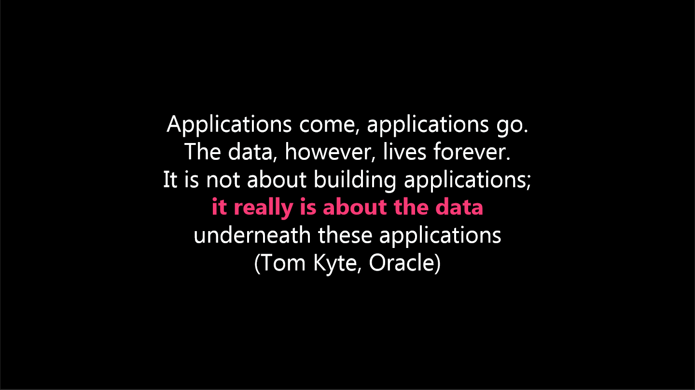

Container haben, durch ihre starke virtualisierung, keinen persistenten Speicher. Der standard Dateispeicher im Container ist nur temporär. Container benötigen deshalb die Möglichkeit Daten persistent zu speichern. Dies wird meist über sogenannte _Mounts_ gelöst, mithilfe derer Dateien auch auf dem Hostbetriebssystem gespeichert werden.

Persistentes Speichern ist wichtig um es Programmen zu erlauben, Daten länger zu Speichern als das Programm läuft. Zudem sollte der Absturz eines Programmes nicht dazu führen, dass alle Daten verloren gehen.

_Abbildung 1: Zitat von Tom Kyte, Oracle. Entnommen aus A. Buckenhofer "Vorlesung: Data Warehouse"_
